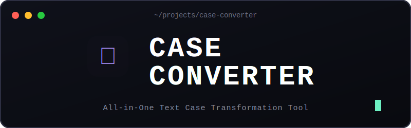

<div align="center">



<br>
<h3>Công cụ chuyển đổi chữ Hoa/Thường toàn diện với hỗ trợ Offline (PWA)</h3>


<br>


<br>

[](#-demo--chạy-local)
[](#-pwa---trải-nghiệm-như-app-thật)
[](#-cấu-trúc-dự-án)

</div>

<hr>

## 🌟 Tính Năng Nổi Bật

| Icon | Tính năng | Mô tả chi tiết |
|:---:|:---|:---|
| 🔠 | **6 Chế độ chuyển đổi** | Hỗ trợ từ `CHỮ HOA`, `chữ thường` đến `Viết Hoa Mỗi Từ`, `xEn KẽM cHỮ`,... |
| 📊 | **Thống kê Realtime** | Tự động đếm số **ký tự**, **số từ**, **số dòng** ngay khi bạn gõ văn bản. |
| 📋 | **Sao chép 1-Click** | Copy toàn bộ kết quả vào clipboard chỉ với một thao tác click chuột. |
| 💾 | **Tải xuống nội dung** | Tự động sinh file `.txt` chứa kết quả để lưu trực tiếp về thiết bị. |
| 📴 | **Chế độ Offline (PWA)** | Hoạt động trơn tru ngay cả khi **mất kết nối internet**, hiển thị banner offline. |
| 📲 | **Cài đặt như App Native** | Có thể cài đặt trực tiếp vào màn hình chính điện thoại, máy tính (Add to Home Screen). |
| 🔗 | **URL Parameters** | Hỗ trợ chọn sẵn chế độ qua URL (VD: thêm `?mode=uppercase` vào đường dẫn). |

<br>

## 🔄 6 Chế Độ Chuyển Đổi

| Chế độ | Ví dụ đầu vào | Kết quả đầu ra |
|:---|:---|:---|
| **CHỮ HOA** | `xin chào việt nam` | `XIN CHÀO VIỆT NAM` |
| **chữ thường** | `XIN CHÀO VIỆT NAM` | `xin chào việt nam` |
| **Viết Hoa Mỗi Từ** | `xin chào việt nam` | `Xin Chào Việt Nam` |
| **Viết hoa đầu câu** | `xin chào. việt nam đẹp.` | `Xin chào. Việt nam đẹp.` |
| **xEn KẽM cHỮ** | `Xin Chào` | `xIN cHÀO` |
| **Viết hoa ký tự đầu** | `xin chào việt nam` | `Xin chào việt nam` |

<hr>

## 🚀 Demo & Chạy Local

Bạn có thể mở file `index.html` trực tiếp trên trình duyệt hoặc deploy lên hosting HTTPS để sử dụng đầy đủ các tính năng PWA!

> ⚠️ **Lưu ý Quan Trọng:** Service Worker và tính năng cài đặt PWA **bắt buộc yêu cầu HTTPS** hoặc `localhost`. Nếu bạn chỉ mở file dạng `file://`, ứng dụng vẫn hoạt động nhưng không thể lưu cache để chạy offline.

### Chạy Local Server với PWA

Để trải nghiệm toàn bộ tính năng:

```bash
# Clone source code
cd case-converter-pwa

# Dùng Python (Có sẵn trên hầu hết các máy)
python3 -m http.server 8080
# => Truy cập: http://localhost:8080

# Hoặc dùng Node.js (Yêu cầu cài đặt npm)
npx serve .

# Hoặc dùng extension "Live Server" trên VS Code
```

<hr>

## 📁 Cấu Trúc Dự Án

Dự án được xây dựng hoàn toàn bằng **HTML/CSS/JS thuần**, không cần build, siêu nhẹ và tối ưu!

```text
case-converter-pwa/
├── index.html          # Giao diện chính và logic ứng dụng
├── manifest.json       # Cấu hình Web App Manifest (cho PWA)
├── sw.js               # Service Worker xử lý cache & offline
├── icons/
│   ├── banner.svg      # Banner hiển thị cho README
│   ├── icon-192.png    # Icon cài đặt (192x192)
│   └── icon-512.png    # Icon cài đặt (512x512)
└── README.md           # Tài liệu hướng dẫn
```

<hr>

## 📲 PWA — Trải Nghiệm Như App Thật

Ứng dụng hỗ trợ cài đặt thẳng vào thiết bị của bạn với trải nghiệm như một App Native.

### Các nền tảng được hỗ trợ:

| Nền tảng | Hướng dẫn cài đặt |
|:---|:---|
| **Android (Chrome)** | Sẽ có thông báo tự động hiện ra, hoặc nhấn menu ⋮ chọn **Thêm vào màn hình chính** |
| **iOS (Safari)** | Nhấn nút **Chia sẻ** (Share) dưới đáy màn hình → chọn **Thêm vào MH chính** |
| **Windows/Mac** | Nhấn biểu tượng ⊕ góc phải thanh địa chỉ, hoặc chọn menu → **Cài đặt ứng dụng** |

<hr>

## 🛠 Nền Tảng Công Nghệ

Sản phẩm được tạo nên bởi các công nghệ web cơ bản nhất nhưng mạnh mẽ nhất:

- **Giao diện & Cấu trúc:** `HTML5` & `CSS3` (Tích hợp responsive & animation mượt mà)
- **Logic cốt lõi:** `Vanilla JavaScript` (Tối ưu tốc độ, không độ trễ)
- **Công nghệ Offline:** `Service Worker API`, `Cache API`, `Web App Manifest`
- **Tiện ích hệ thống:** `Clipboard API` (Copy nhanh)
- **Typography:** `Google Fonts` (Be Vietnam Pro, Playfair Display)

<hr>

## 📄 License

Dự án này được phân phối dưới giấy phép **MIT License**. Bạn hoàn toàn tự do sử dụng, chỉnh sửa và phân phối lại.

<br>
<p align="center">
  <b>Làm với ❤️ · Hỗ trợ tiếng Việt đầy đủ · Hoàn toàn miễn phí</b>
</p>
